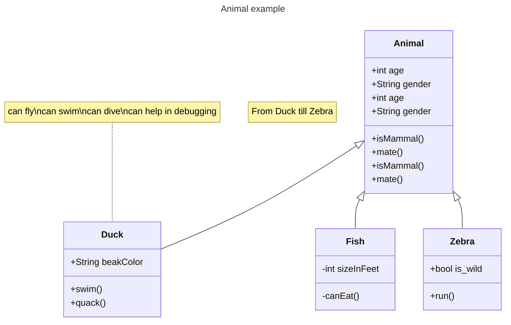
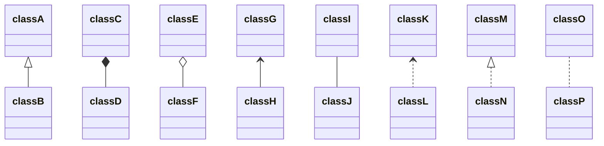

#  Class diagrams[#](https://mermaid.js.org/syntax/classDiagram.html#class-diagrams)

The class diagram is the main building block of object-oriented modeling. It is used for general conceptual modeling of the structure of the application, and for detailed modeling to translate the models into programming code. Class diagrams can also be used for data modeling. The classes in a class diagram represent both the main elements, interactions in the application, and the classes to be programmed.

Mermaid can render class diagrams.

[](https://www.youtube.com/watch?v=Tgqsgc3pvu0 "Mermaid's Class Driagram")

##### Code:
```
---
title: Animal example
---
classDiagram
	note "From Duck till Zebra"
	Animal <|-- Duck
	note for Duck "can fly\ncan swim\ncan dive\ncan help in debugging"
	Animal <|-- Fish
	Animal <|-- Zebra
	class Animal{
		+int age
		+String gender
		+isMammal()
		+mate()
	}
	Animal : +int age
	Animal : +String gender
	Animal: +isMammal()
	Animal: +mate()
	class Duck{
		+String beakColor
		+swim()
		+quack()
	}
	class Fish{
		-int sizeInFeet
		-canEat()
	}
	class Zebra{
		+bool is_wild
		+run()
	}
```


##### Rendered output


## Visibility

To describe the visibility (or encapsulation) of an attribute or method/function that is a part of a class (i.e. a class member), optional notation may be placed before that members' name:

-   `+` Public
-   `-` Private
-   `#` Protected
-   `~` Package/Internal

> _note_ you can also include additional _classifiers_ to a method definition by adding the following notation to the _end_ of the method, i.e.: after the `()`:
> 
> -   `*` Abstract e.g.: `someAbstractMethod()*`
> -   `$` Static e.g.: `someStaticMethod()$`

> _note_ you can also include additional _classifiers_ to a field definition by adding the following notation to the end of its name:
> 
> -   `$` Static e.g.: `String someField$`


## Defining Relationship

A relationship is a general term covering the specific types of logical connections found on class and object diagrams.

```
[classA][Arrow][ClassB]
```

There are eight different types of relations defined for classes under UML which are currently supported:
<table>
	<thead>
		<tr><th>Type</th><th>Description</th></tr>
	</thead>
	<tbody>
		<tr><td><code>&lt;|--</code></td><td>Inheritance</td></tr>
		<tr><td><code>*--</code></td><td>Composition</td></tr>
		<tr><td><code>o--</code></td><td>Aggregation</td></tr>
		<tr><td><code>--&gt;</code></td><td>Association</td></tr>
		<tr><td><code>--</code></td><td>Link (Solid)</td></tr>
		<tr><td><code>..&gt;</code></td><td>Dependency</td></tr>
		<tr><td><code>..|&gt;</code></td><td>Realization</td></tr>
		<tr><td><code>..</code></td><td>Link (Dashed)</td></tr>
	</tbody>
</table>

#### Code:
```
classDiagram
classA <|-- classB
classC *-- classD
classE o-- classF
classG <-- classH
classI -- classJ
classK <.. classL
classM <|.. classN
classO .. classP
```

##### Rendered output
