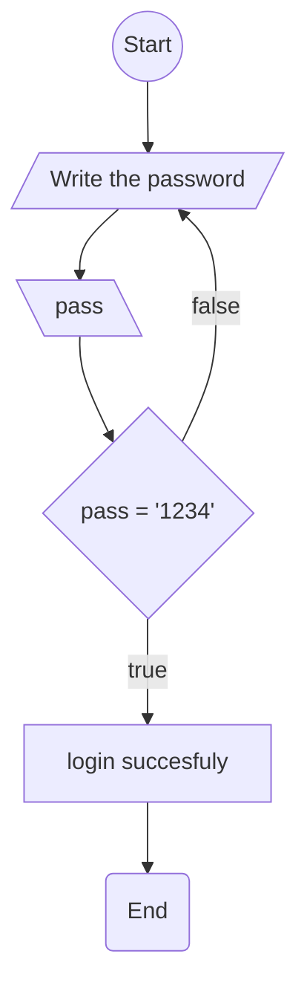

# [](../Markdown.md) Flowcharts - Basic Syntax [#](https://mermaid.js.org/syntax/flowchart.html#flowcharts-basic-syntax)
---

All Flowcharts are composed of **nodes**, the geometric shapes and **edges**, the arrows o

All Flowcharts are composed of **nodes**, the geometric shapes and **edges**, the arrows or lines. The mermaid code defines the way that these **nodes** and **edges** are made and interact.

It can also accommodate different arrow types, multi directional arrows, and linking to and from subgraphs.

##### This is an example of mermaid code for flowcharts:

```
flowchart TB
A((Start))
B[/Write the password/]	
C[\pass\]	
D{ pass = '1234' }	
E[login succesfuly]	
F(End)

A --> B --> C --> D --> |true| E --> F
D --> |false| B
```

##### The rendered output looks like this:

